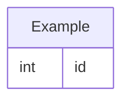
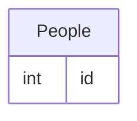

# Sub-Comando Model

Este subcomando es utilizado el manejo de los modelos para la base de datos del proyecto.

```
.
└── isy
    └── model
        └── new

Arguments:
- name: Nombre del nuevo modelo.
- tablename: Nombre de la tabla. Default='same-model-name'
```

```isy model new```

Con este comando se creará el modelo para la definicion del proyecto, por lo que creará el servicio, el controlador y el ruteo correspondiente.

Se creará los archivos correspondientes con el siguiente formato en las ubicaciones:

* api/app/Data/Models/_ModelName_.py
* api/app/Data/Services/_ModelName_ Service.py
* api/app/Controllers/_ModelName_ Controller.py
* api/routes/_ModelName_ Router.py

Así como moficar los siguientes archivos para el import y ruteo correspondiente:

* api/app/Data/Models/__ init__.py
* api/app/Data/Services/__ init__.py
* api/app/Controllers/__ init__.py
* api/routes/__ init__.py
* api/__ init__.py

## Modelos, la base de todo

Como se indicó anteriormente, esta estructura se basa para funcionar totalmente en modelos.

Un modelo básicamente es la representación en una clase de una estructura de datos (una tabla de una DB relacional en este caso). El cuál tiene una estructura similar a como se muestra a continuación, destacando las partes de los métodos de clases que nos serán útiles posteriormente,

```python
from typing import Any, Dict, List
from sqlalchemy import Column, Integer, String
from ...Core.Data.BaseModel import BaseModel

class ModelName(BaseModel):
    """ Table ModelNames Database model

    Args:
        BaseModel (ORMClass): Parent class

    Returns:
        ModelName: Instance of model
    """
    __tablename__ = 'ModelNames'    # Nombre de la tabla en la DB
    id = Column("IdModelName", Integer, primary_key=True)
    .
    .                               # Aquí van todas las propiedades (columnas) de nuestro modelo/tabla
    .

    
    # Como se llamará nuestra ruta desde API
    model_path_name = "modelname"
    # Nombre de las propiedades a las que se les podrá aplicar filtros
    filter_columns = []
    # Nombre de las relaciones de este modelo con otros (ORM)
    relationship_names = []
    # Nombre delas propiedades a las que se les podrá hacer búsqueda con el método LIKE %search%
    search_columns = []
    

    # Mapeo de los nombres de propiedades con la respuesta del API
    def property_map(self) -> Dict:
        return {
            "id": "IdModelName"
        }
    
    # Propiedades que se mostrarán en la respuesta del API
    @classmethod
    def display_members(cls_) -> List[str]: 
        return [
            "id"
        ]

    # Reglas de validaciones del modelo antes de guardar en la DB (Revisar Validators)
    @classmethod
    def rules_for_store(cls_) -> Dict[str, List[Any]]:
        return {
            
        }

    # Método que se ejecuta antes de guardar un registro en la base de datos
    def before_save(self, sesion: Session, *args, **kwargs):
        pass
    
    # Método que se ejecuta después de guardar un registro en la base de datos
    def after_save(self, sesion: Session, *args, **kwargs):
        pass

    # Método que se ejecuta antes de actualizar un registro en la base de datos
    def before_update(self, sesion: Session, *args, **kwargs):
        pass

    # Método que se ejecuta después de actualizar un registro en la base de datos
    def after_update(self, sesion: Session, *args, **kwargs):
        pass
    
    # Método que se ejecuta antes de eliiminar un registro en la base de datos
    def before_delete(self, sesion: Session, *args, **kwargs):
        pass

    # Método que se ejecuta después de eliminar un registro en la base de datos
    def after_delete(self, sesion: Session, *args, **kwargs):
        pass
```

## Ejemplos y afectaciones

```isy model new  --name=Example```

```
.
├── /api/
│   ├── /app/
│   │   ├── /Controllers/
│   │   │   ├── __init__.py
│   │   │   └── ExampleController.py
│   │   │   └── /Models/
│   │   │       ├── __init__.py
│   │   │       └── Example.py
│   │   ├── /Services/
│   │   │   ├── __init__.py
│   │   │   └── ExampleService.py
│   ├── /routes/
│   │   ├── __init__.py
│   │   └── ExampleRouter.py
```



```isy model new  --name=Person --tablename=Peole```

```
.
├── /api/
│   ├── /app/
│   │   ├── /Controllers/
│   │   │   ├── __init__.py
│   │   │   └── PersonController.py
│   │   │   └── /Models/
│   │   │       ├── __init__.py
│   │   │       └── Person.py
│   │   ├── /Services/
│   │   │   ├── __init__.py
│   │   │   └── PersonService.py
│   ├── /routes/
│   │   ├── __init__.py
│   │   └── PersonRouter.py
```

